# mermaid绘图大全

本页提供 31 种图表示例。修改代码即可更新预览；示例也可作为新图表的起点。

其他文档：[Markdown 编辑与文件操作](markdown完全语法示例.md)、[公式与代码运行](公式和代码示例.md)。

## 编辑与预览

插入代码块并将语言设为 `mermaid`。在预览编辑中点击“编辑”展开源码，修改后点击“收起”查看图表；阅读模式只显示图表。代码块右键可复制源码，语言也可以从列表中搜索。

图表使用 Mermaid 渲染，流程图可使用 ELK 布局。图表颜色和字体随当前主题与文档字体更新。

## 尺寸与高度

| 属性 | 作用 |
| --- | --- |
| `size=640` | 图表宽度设为 640 像素，高度按比例变化 |
| `size=80%` | 图表按原始尺寸的 80% 缩放 |
| `height=180` | 限制源码编辑区域高度，与图表缩放分开控制 |

在语言右侧的属性输入框填写属性，可组合使用，如 `size=80% height=180`。尺寸只接受无单位数字或百分比；不设置时采用默认尺寸并适应可用宽度。

## 图表示例

### 1. 流程图

描述步骤、条件和循环。`LR` 表示从左到右，改为 `TB` 可改为从上到下；连线上的文字用 `|文字|` 标注。

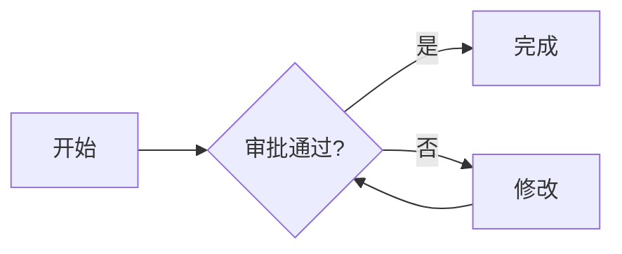
```mermaid {id=0001}
flowchart LR
 A[开始] --> B{审批通过?}
 B -->|是| C[完成]
 B -->|否| D[修改]
 D --> B
```

### 2. 时序图

描述参与者之间的消息顺序。实线、虚线和异步箭头分别表达不同的消息类型，可修改参与者和消息文字。

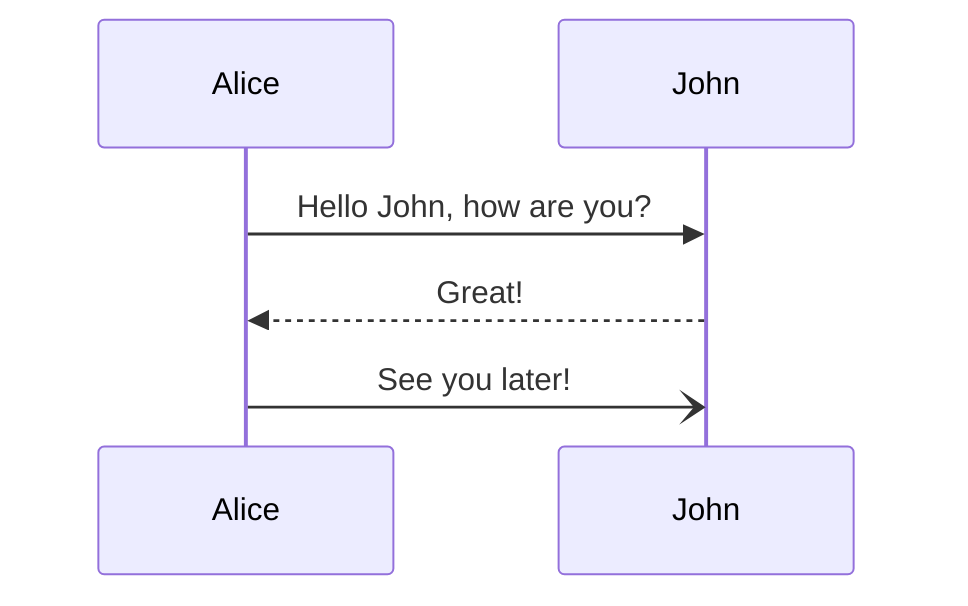
```mermaid {id=0002}
sequenceDiagram
    Alice->>John: Hello John, how are you?
    John-->>Alice: Great!
    Alice-)John: See you later!
```

### 3. 类图

描述类的成员、方法和关系。适合整理接口、继承和数据模型。

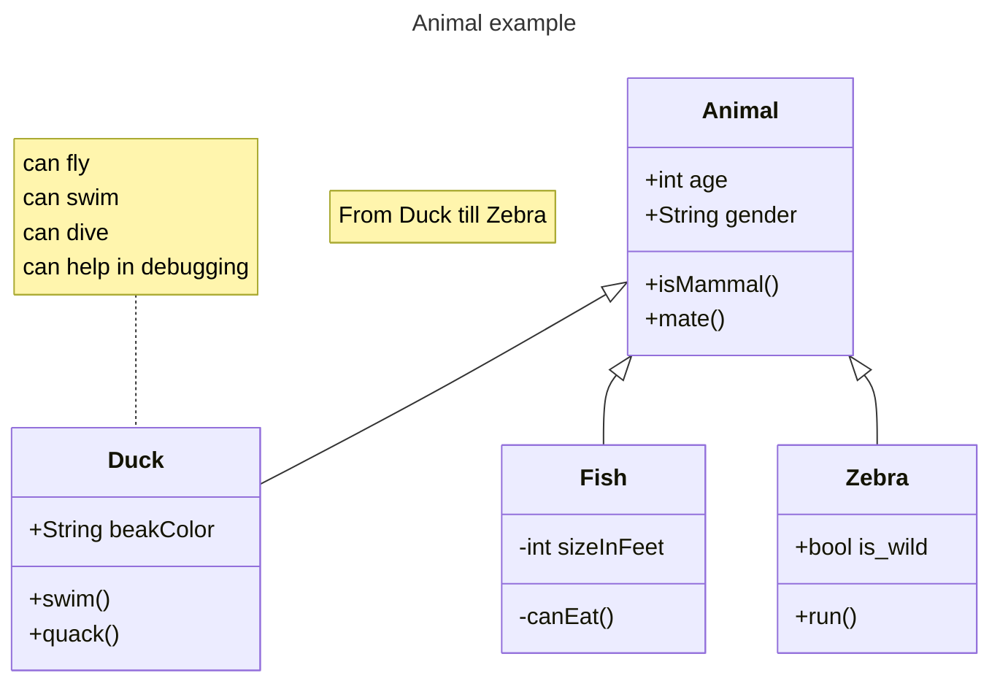
```mermaid {id=0003}
---
title: Animal example
---
classDiagram
    note "From Duck till Zebra"
    Animal <|-- Duck
    note for Duck "can fly<br>can swim<br>can dive<br>can help in debugging"
    Animal <|-- Fish
    Animal <|-- Zebra
    Animal : +int age
    Animal : +String gender
    Animal: +isMammal()
    Animal: +mate()
    class Duck{
        +String beakColor
        +swim()
        +quack()
    }
    class Fish{
        -int sizeInFeet
        -canEat()
    }
    class Zebra{
        +bool is_wild
        +run()
    }
```

### 4. 状态图

描述状态与转换。`[*]` 表示起点或终点，子状态可用于分组。

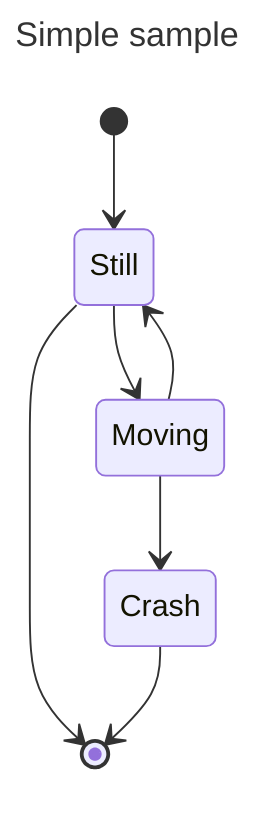
```mermaid {id=0004}
---
title: Simple sample
---
stateDiagram-v2
    [*] --> Still
    Still --> [*]

    Still --> Moving
    Moving --> Still
    Moving --> Crash
    Crash --> [*]
```

### 5. 实体关系图（ER）

描述实体、字段和基数关系。可用来记录数据库或业务数据结构。

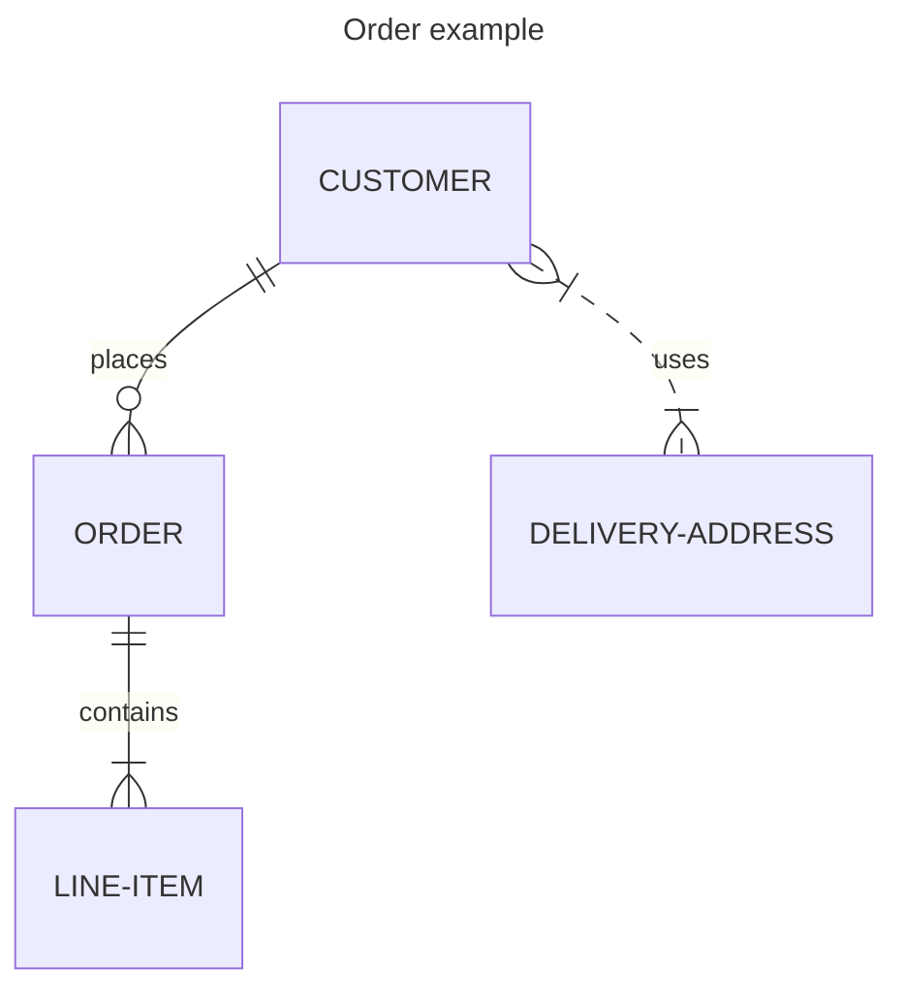
```mermaid {id=0005}
---
title: Order example
---
erDiagram
    CUSTOMER ||--o{ ORDER : places
    ORDER ||--|{ LINE-ITEM : contains
    CUSTOMER }|..|{ DELIVERY-ADDRESS : uses
```

### 6. 用户旅程

展示用户在不同阶段的体验评分和参与者。适合把操作步骤与体验评价一起记录。

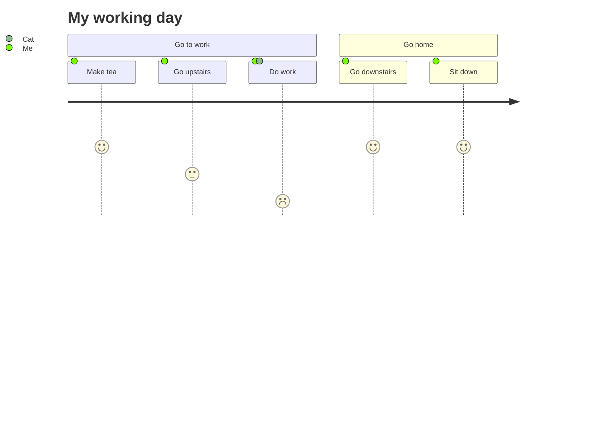
```mermaid {id=0006}
journey
    title My working day
    section Go to work
      Make tea: 5: Me
      Go upstairs: 3: Me
      Do work: 1: Me, Cat
    section Go home
      Go downstairs: 5: Me
      Sit down: 5: Me
```

### 7. 甘特图

展示任务工期与依赖。`dateFormat` 定义输入日期，`axisFormat` 定义显示格式；`after` 引用前置任务。需要固定刻度时可添加 `tickInterval 1week`。

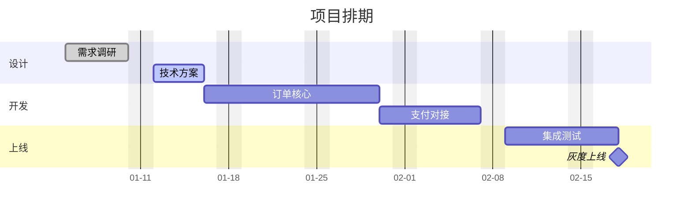
```mermaid {id=0007}
gantt
 title 项目排期
 dateFormat YYYY-MM-DD
 axisFormat %m-%d
 excludes weekends
 section 设计
 需求调研 :done, des1, 2026-01-05, 5d
 技术方案 :active, des2, after des1, 4d
 section 开发
 订单核心 :dev1, after des2, 10d
 支付对接 :dev2, after dev1, 6d
 section 上线
 集成测试 :test1, after dev2, 7d
 灰度上线 :milestone, m1, after test1, 0d
```

### 8. 饼图

比较各类别占比。`showData` 显示数值；修改名称和数值即可调整扇区，颜色随主题保持区分。

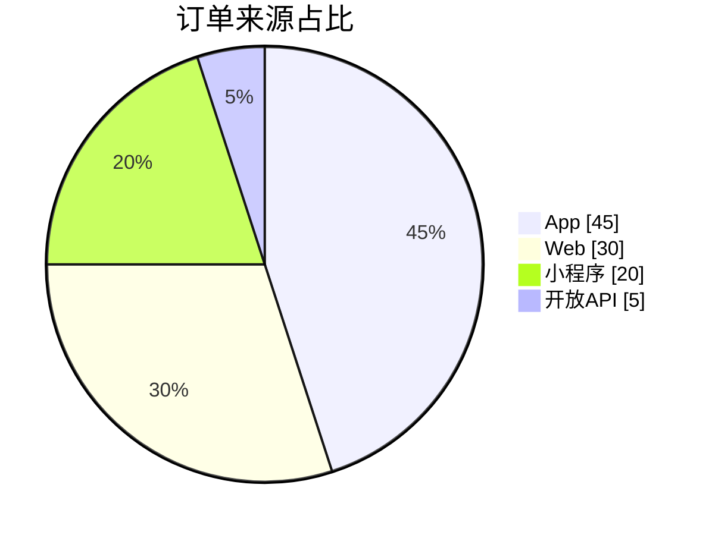
```mermaid {id=0008}
pie showData
 title 订单来源占比
 "App": 45
 "Web": 30
 "小程序": 20
 "开放API": 5
```

### 9. 象限图

按两个维度比较对象。坐标通常取 0 到 1，可修改轴名称和象限说明。

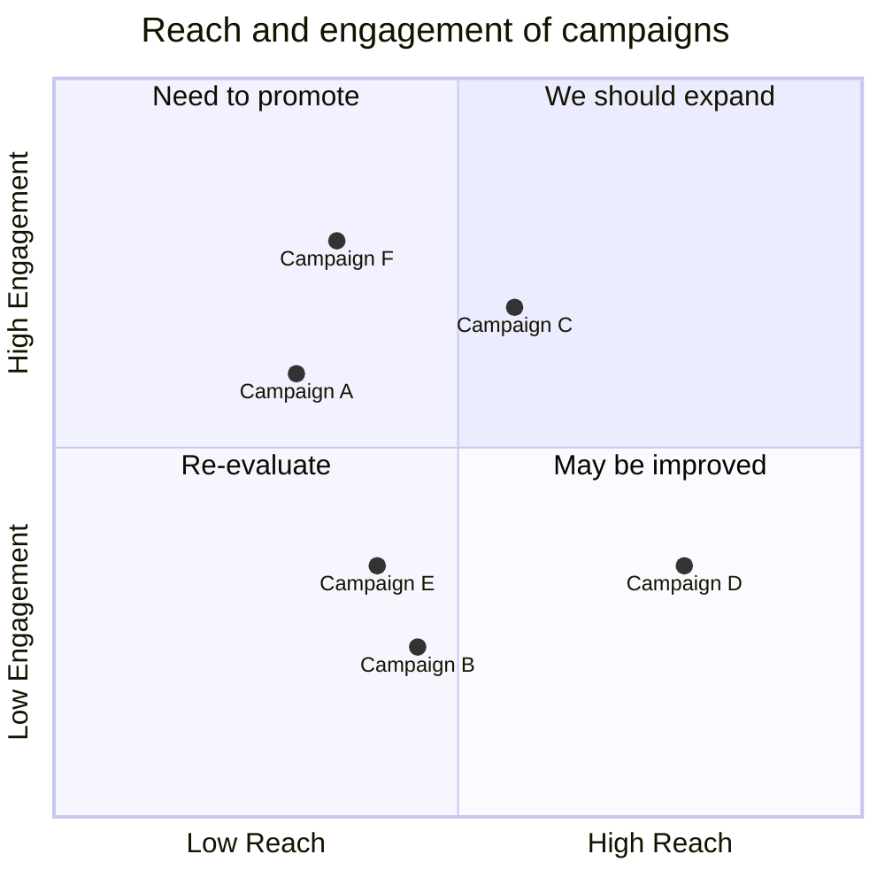
```mermaid {id=0009}
quadrantChart
    title Reach and engagement of campaigns
    x-axis Low Reach --> High Reach
    y-axis Low Engagement --> High Engagement
    quadrant-1 We should expand
    quadrant-2 Need to promote
    quadrant-3 Re-evaluate
    quadrant-4 May be improved
    Campaign A: [0.3, 0.6]
    Campaign B: [0.45, 0.23]
    Campaign C: [0.57, 0.69]
    Campaign D: [0.78, 0.34]
    Campaign E: [0.40, 0.34]
    Campaign F: [0.35, 0.78]
```

### 10. 需求图

记录需求及其满足、派生等关系。节点中可以写需求编号、风险和验证方式。

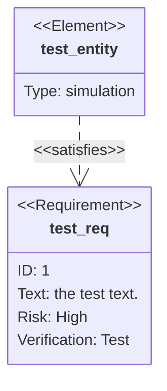
```mermaid {id=000a}
requirementDiagram

    requirement test_req {
    id: 1
    text: the test text.
    risk: high
    verifymethod: test
    }

    element test_entity {
    type: simulation
    }

    test_entity - satisfies -> test_req
```

### 11. 分支图

展示分支、提交和合并关系。

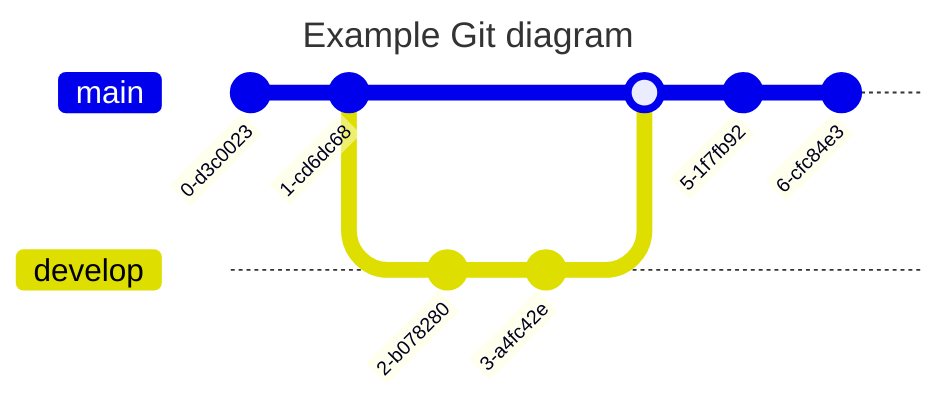
```mermaid {id=000b}
---
title: Example Git diagram
---
gitGraph
   commit
   commit
   branch develop
   checkout develop
   commit
   commit
   checkout main
   merge develop
   commit
   commit
```

### 12. C4 系统上下文

从系统上下文说明用户、外部系统及其关系。适合架构说明中的总览图。

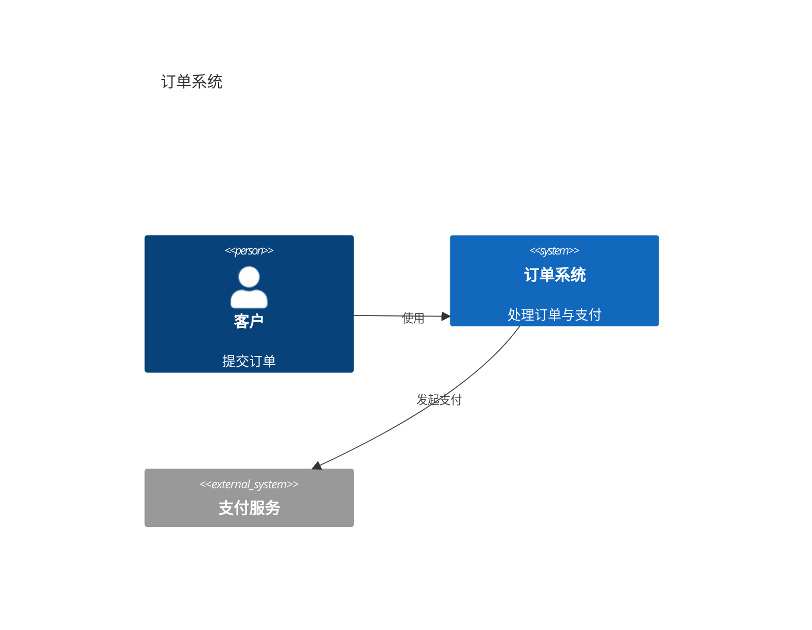
```mermaid {id=000c}
C4Context
 title 订单系统
 Person(customer, "客户", "提交订单")
 System(app, "订单系统", "处理订单与支付")
 System_Ext(pay, "支付服务")
 Rel(customer, app, "使用")
 Rel(app, pay, "发起支付")
```

### 13. 思维导图

按缩进表达层级。根节点用圆括号或双圆括号定义外形，文本与子节点可直接修改。

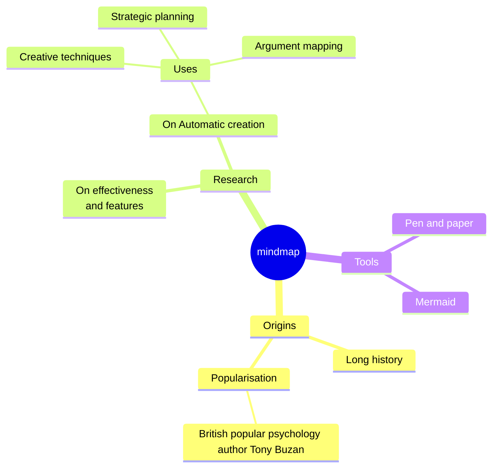
```mermaid {id=000d}
mindmap
  root((mindmap))
    Origins
      Long history
      Popularisation
        British popular psychology author Tony Buzan
    Research
      On effectiveness<br/>and features
      On Automatic creation
        Uses
            Creative techniques
            Strategic planning
            Argument mapping
    Tools
      Pen and paper
      Mermaid
```

### 14. 时间线

按时间段排列事件。适合版本计划、项目阶段或历史记录。

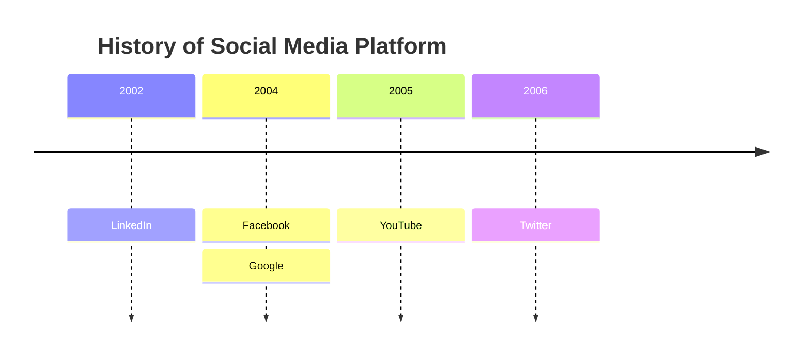
```mermaid {id=000e}
timeline
    title History of Social Media Platform
    2002 : LinkedIn
    2004 : Facebook
         : Google
    2005 : YouTube
    2006 : Twitter
```

### 15. 桑基图

用连线宽度表达数量流向。每行包含来源、去向和数值，适合资源或业务流量分析。

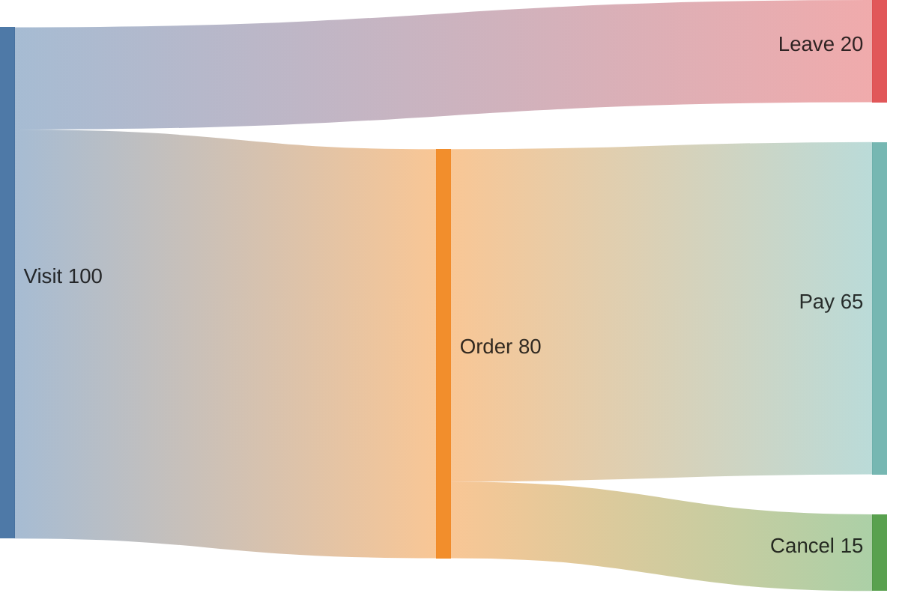
```mermaid {id=000f}
sankey
Visit,Order,80
Visit,Leave,20
Order,Pay,65
Order,Cancel,15
```

### 16. 柱状图与折线图（XY）

绘制柱状或折线数据。横轴标签与数据数量应对应，也可以在同一图中组合两种数据。

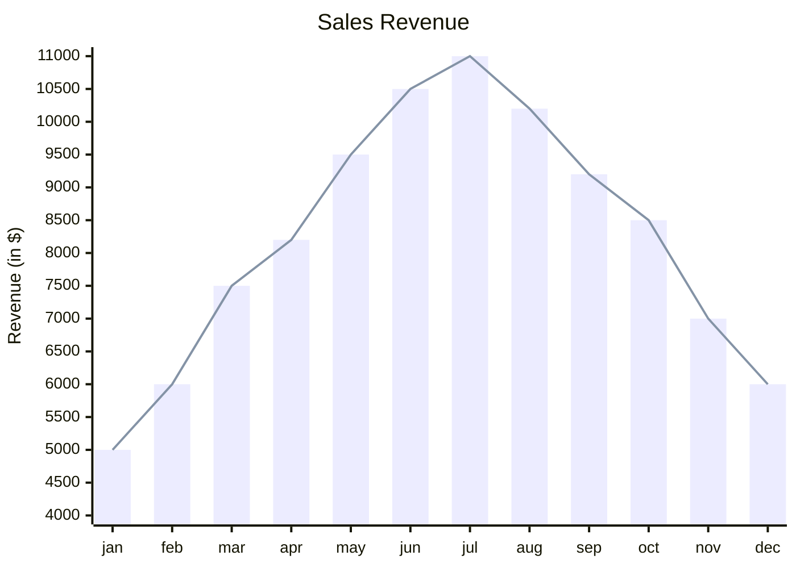
```mermaid {id=0010}
xychart
    title "Sales Revenue"
    x-axis [jan, feb, mar, apr, may, jun, jul, aug, sep, oct, nov, dec]
    y-axis "Revenue (in $)" 4000 --> 11000
    bar [5000, 6000, 7500, 8200, 9500, 10500, 11000, 10200, 9200, 8500, 7000, 6000]
    line [5000, 6000, 7500, 8200, 9500, 10500, 11000, 10200, 9200, 8500, 7000, 6000]
```

### 17. 块图

通过行列和跨度控制块的位置。适合需要明确对齐关系的结构图。

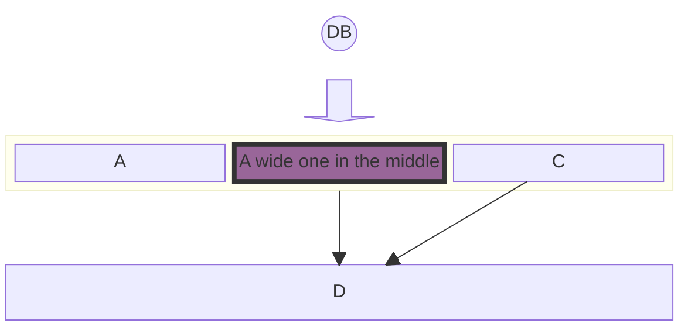
```mermaid {id=0011}
block
columns 1
  db(("DB"))
  blockArrowId6<["&nbsp;&nbsp;&nbsp;"]>(down)
  block:ID
    A
    B["A wide one in the middle"]
    C
  end
  space
  D
  ID --> D
  C --> D
  style B fill:#969,stroke:#333,stroke-width:4px
```

### 18. 报文图

按位展示报文或协议字段。数字范围表示字段占用的位数。

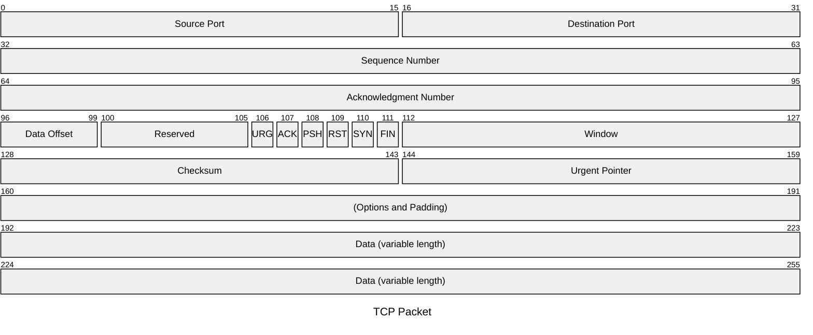
```mermaid {id=0012}
---
title: "TCP Packet"
---
packet
0-15: "Source Port"
16-31: "Destination Port"
32-63: "Sequence Number"
64-95: "Acknowledgment Number"
96-99: "Data Offset"
100-105: "Reserved"
106: "URG"
107: "ACK"
108: "PSH"
109: "RST"
110: "SYN"
111: "FIN"
112-127: "Window"
128-143: "Checksum"
144-159: "Urgent Pointer"
160-191: "(Options and Padding)"
192-255: "Data (variable length)"
```

### 19. 看板

按列组织任务。可以调整列名称、任务标题和元数据。

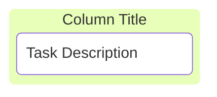
```mermaid {id=0013}
kanban
  column1[Column Title]
    task1[Task Description]
```

### 20. 架构图

用分组、服务和端点表达架构连接。适合模块、基础设施和部署关系。

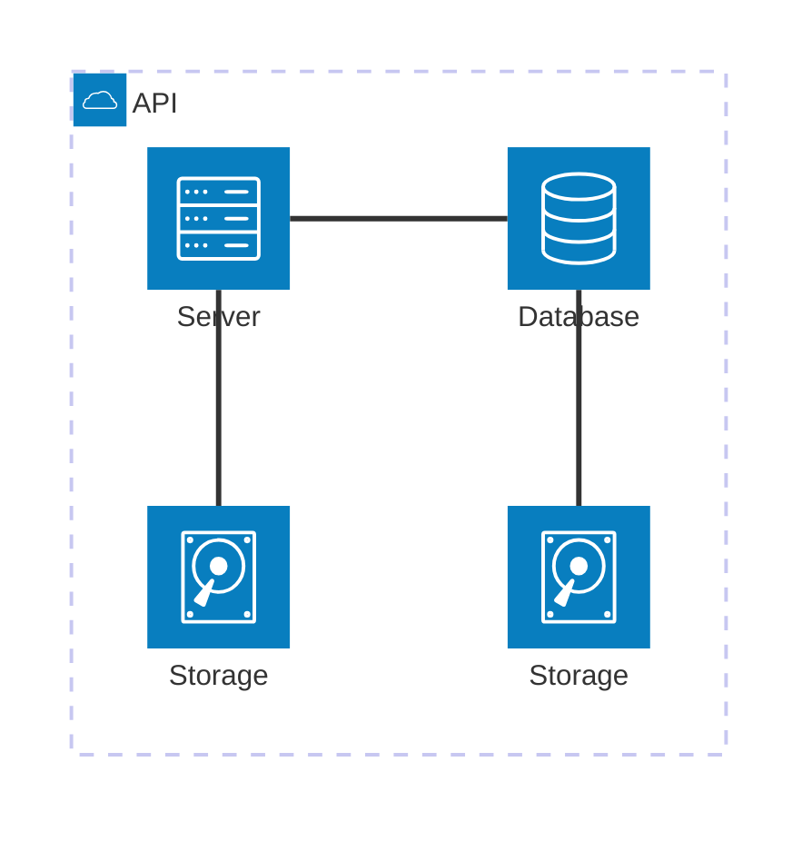
```mermaid {id=0014}
architecture-beta
    group api(cloud)[API]

    service db(database)[Database] in api
    service disk1(disk)[Storage] in api
    service disk2(disk)[Storage] in api
    service server(server)[Server] in api

    db:L -- R:server
    disk1:T -- B:server
    disk2:T -- B:db
```

### 21. 雷达图

在多个维度上比较系列。各系列需要使用相同的坐标维度。

```mermaid {id=0015}
---
title: "Grades"
---
radar-beta
  axis m["Math"], s["Science"], e["English"]
  axis h["History"], g["Geography"], a["Art"]
  curve a["Alice"]{85, 90, 80, 70, 75, 90}
  curve b["Bob"]{70, 75, 85, 80, 90, 85}

  max 100
  min 0
```

### 22. 矩形树图

按矩形面积显示分组数据。层次由缩进表达，叶节点带数值。

```mermaid {id=0016}
treemap-beta
"Category A"
    "Item A1": 10
    "Item A2": 20
"Category B"
    "Item B1": 15
    "Item B2": 25
```

### 23. 韦恩图

展示集合及其交集。修改集合名称、关系和样式可调整展示。

```mermaid {id=0017}
venn-beta
  title What makes a good feature
  set Desirable
  set Feasible
  set Viable
  union Desirable,Feasible["Buildable"]
  union Feasible,Viable["Sustainable"]
  union Desirable,Viable["Marketable"]
  union Desirable,Feasible,Viable["Ship it"]
```

### 24. 鱼骨图

按类别整理原因。适合问题分析与改进措施讨论。

```mermaid {id=0018}
ishikawa-beta
    Blurry Photo
    Process
        Out of focus
        Shutter speed too slow
        Protective film not removed
        Beautification filter applied
    User
        Shaky hands
    Equipment
        LENS
            Inappropriate lens
            Damaged lens
            Dirty lens
        SENSOR
            Damaged sensor
            Dirty sensor
    Environment
        Subject moved too quickly
        Too dark
```

### 25. Wardley 图

在价值链与演进维度上放置组件。可修改组件位置和依赖关系。

```mermaid {id=0019}
wardley-beta
title Tea Shop Value Chain

anchor Business [0.95, 0.63]
component Cup of Tea [0.79, 0.61]
component Tea [0.63, 0.81]
component Hot Water [0.52, 0.80]
component Kettle [0.43, 0.35]
component Power [0.10, 0.70]

Business -> Cup of Tea
Cup of Tea -> Tea
Cup of Tea -> Hot Water
Hot Water -> Kettle
Kettle -> Power

evolve Kettle 0.62
evolve Power 0.89

note "Standardising power allows Kettles to evolve faster" [0.30, 0.49]
```

### 26. Cynefin 图

按情境分类问题与处理方式。将示例文字替换为实际事件即可。

```mermaid {id=001a}
cynefin-beta
  title Incident Response

  complex
    "Investigate root cause"
    "Run chaos experiment"

  complicated
    "Analyze performance data"
    "Expert review needed"

  clear
    "Restart service"
    "Apply known fix"

  chaotic
    "Page on-call immediately"

  confusion
    "Unknown failure mode"
```

### 27. 用例图

展示角色、系统边界和用例。适合记录用户与系统的交互范围。

```mermaid {id=001b}
usecase-beta
direction LR
actor Customer("Customer")
systemBoundary "Order system"
  Checkout("Place order")
end
Customer --> Checkout
```

### 28. 泳道图

把步骤按参与者或职责分组。适合跨部门流程与交接说明。

```mermaid {id=001c}
swimlane-beta LR
  subgraph Customer
    Browse[Browse catalogue]
    Pay[Pay]
  end
  subgraph Warehouse
    Pick[Pick items]
    Ship[Ship order]
  end
  subgraph Finance
    Invoice[Raise invoice]
  end
  Browse --> Pay
  Pay --> Pick
  Pick --> Ship
  Pay --> Invoice
```

### 29. 目录树

以树形字符表示文件结构。修改文件名和层级即可描述项目目录。

```mermaid {id=001d}
treeView-beta
├── src/
│   ├── index.ts
│   └── utils.ts
├── package.json
└── README.md
```

### 30. 铁路图

将 EBNF 规则绘制为语法路径。适合协议、表达式和解析规则说明。

```mermaid {id=001e}
railroad-ebnf-beta
title "Digit Definition"

digit = "0" | "1" | "2" | "3" | "4" | "5" | "6" | "7" | "8" | "9" ;
```

### 31. 事件建模

把界面、命令和事件放在同一时间流程中。适合围绕业务事件讨论交互设计。

```mermaid {id=001f}
eventmodeling

tf 01 ui CartUI
tf 02 cmd AddItem
tf 03 evt ItemAdded
```

## 排版与导出

节点较多时可调整 `LR` / `TB` 方向、使用分组，或拆成多张图。甘特图日期密集时优先调整刻度；单纯缩小整张图会让文字更难阅读。

输入尚未完成时，错误信息会显示在预览区域。先检查图表声明、缩进、括号和节点引用，再查看提示的位置。

使用“更多文档操作”导出 HTML / PDF，图表以 SVG 矢量嵌入；PDF 使用当前阅读字体和配色。需要稳定的分享版式时，先在阅读模式检查图表宽度。

本页以应用内置 Mermaid 12.1.0 为准，标有 `beta` 的图表语法可能随版本变化。ZenUML 扩展未内置。语法参考：[Mermaid 官方文档](https://mermaid.js.org/intro/)。示例沿用其 MIT 许可文档中的基础语法。
